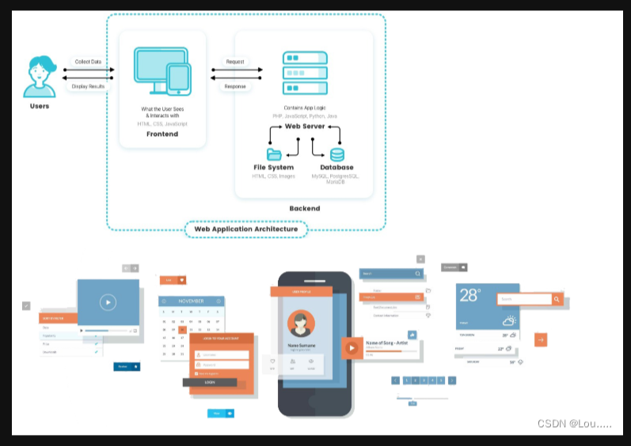

# React 基础
## 1.React概述

目标：了解 React 是什么

 [官方文档（英文）](https://reactjs.org/),[官方文档（中文）](https://zh-hans.reactjs.org/) 

 **官方释义：** A JavaScript library for building user interfaces （一个用于构建用户界面的 JavaScript 库）。 

 React 是一个开源的 javaScript 库 用于构建 web 应用中的视图层 就是web 应用中的前端用户界面 


 React 是目前最为流行的[前端框架](https://so.csdn.net/so/search?q=前端框架&spm=1001.2101.3001.7020)之一。 


**[npm 前端三大框架下载量对比](https://npmtrends.com/angular-vs-react-vs-vue)**




 **[谷歌搜索 前端三大框架搜索对比](https://trends.google.com/trends/explore?q=react,vue,angular)** 


React 是 Facebook 的软件工程师在 2012 年创建 于 2013年5月开源 目前由 facebook 以及个人开发人员和公司组成的社区维护。

React 起源于 facebook 的内部项目 因为当时该公司的市场上所有 javascript 框架都不满意 就决定自己写一套用来设计 instagram 的网站。

和其他前端框架相比 React 社区非常活跃 这就意味在构建客户端 wdb 应用的过程中你遇到的问题几乎都可以在社区中找到答案。


[Stack Overflow](https://stackoverflow.com/questions/tagged/reactjs)


##  2.创建React项目

目标：掌握使用[脚手架](https://so.csdn.net/so/search?q=脚手架&spm=1001.2101.3001.7020)创建 React 项目的方式 

```react
# 全局安装 react 官方提供的脚手架工具 create-react-app （CRA）
npm install create-react-app@5.0.1 -g
# 使用 CRA 创建项目 项目名称为 react-basic
create-react-app react-basic
# 切换到项目根目录
cd react-basic
# 启动项目
npm start
```

```React
# 创建项目的第二种方式
npm init react-app react-basic
```


```tet
# 项目结构分析
-----------------------------------------------------------------------------------------
|--- README.md                 项目的说明书                      
|--- package.json              npm 包说明文件 记录项目信息                       
|--- package-lock.json         跟踪被安装的每个软件包的确切版本                   
|--- public                    本地开发服务器提供的静态资源目录                   
|    |--- favicon.ico          网站图标、显示在浏览器的标签栏中                  
|    |--- index.html           项目的 HTML 模板                               
|    |--- logo192.png          react logo 图片 (示例代码中用于设置 IOS 移动端网站图标)
|    |--- logo512.png          react logo 图片                                             
|    |--- manifest.json        web 应用清单如名称, 作者, 图标和描述 (主要用于将 Web 应用程序安装到设备的主屏幕)     
|    |--- robots.txt           爬虫协议文件                                                 
|--- src                       项目源码目录                                                 
|    |--- App.css              示例程序中的根组件样式文件                                     
|    |--- App.js               示例程序中的根组件文件                                         
|    |--- App.test.js          示例程序中的根组件测试文件                                     
|    |--- index.css            示例程序中的全局样式文件                                      
|    |--- index.js             项目的入口文件      
|    |--- logo.svg             示例程序中根组件中显示的网站图标文件   
|    |--- reportWebVitals.js   测试应用程序的性能                   
|    |--- setupTests.js        项目的测试文件                     
-----------------------------------------------------------------------------------------

```

 [VSCODE扩展-ES7+ React/Redux/React-Native snippets](https://marketplace.visualstudio.com/items?itemName=dsznajder.es7-react-js-snippets) 


##  3. React初体验

 目标： 创建 h1 标题元素、渲染该标题元素 

```React
<!-- 即将创建 h1 元素 -->
<h1 title="Hello React" id="title">Hello React</h1>

```
```React
<!-- public/index.html -->
<!-- 将创建好的 h1 元素渲染到 id 为 root 的 div 中 -->
<div id="root">
	<h1 title="Hello React" id="title">Hello React</div>
</div>

```
```React
// src/index.js
// React 既可以构建在浏览器中运行的 web 应用, 也可以构建在移动端运行的原生应用, React 在构建这两种应用时会有一些通用方法和一些非通用方法, 通用方法都被放置在了 react 包中，非通用方法比如实现 web 应用的方法被放置在了 react-dom 包中, 实现移动端应用的方法被放置在了 react-native-web 文件中.
// react：核心库, 包含了构建 web 应用和构建移动端应用的通用方法.
import React from "react";
// react-dom：只包含了构建 web 应用的方法.
import ReactDOM from "react-dom/client";

// React.createElement(type, props, children): React 提供的创建元素的方式
// type: 标签名称, 字符串类型.
// props: 元素属性, 对象类型, 无属性填入 null
// children: 子元素, 普通文本或 createElement 方法返回的元素对象
// return: 元素对象
const title = React.createElement(
  "h1",
  { id: "title", title: "Hello React" },
  "Hello React"
);
// 创建 React 应用的根节点
const root = ReactDOM.createRoot(document.getElementById("root"));
// 将标题渲染到该根节点中
root.render(title);

```